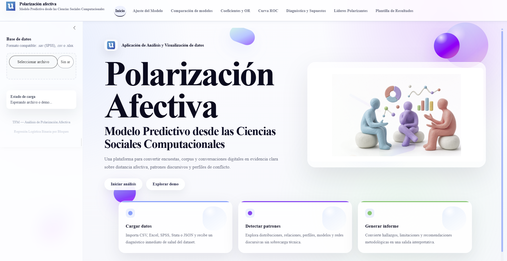

# Polarización Afectiva en España

### Modelo predictivo desde las Ciencias Sociales Computacionales

Aplicación interactiva desarrollada en **R Shiny** para explorar factores asociados a la polarización afectiva mediante preparación de datos, regresión logística binaria por bloques, diagnóstico estadístico y visualización de resultados.

El proyecto nace como aplicación asociada a una investigación académica sobre **polarización afectiva en España** y busca convertir resultados estadísticos complejos en una lectura clara, reproducible e interpretable desde las Ciencias Sociales.

[**Abrir aplicación online**](http://adriesteban11.shinyapps.io/app-r-tfm-polarizacion)

---

## Vista de la aplicación



---

## Qué permite hacer

- Importar bases en **SPSS (`.sav`)**, **CSV (`.csv`)** y **Excel (`.xlsx`)**.
- Preparar automáticamente las variables necesarias para el análisis.
- Estimar una **regresión logística binaria por bloques**.
- Comparar el ajuste incremental entre modelos.
- Examinar coeficientes, *odds ratios* e intervalos de confianza.
- Representar la curva ROC y calcular el AUC.
- Calcular el R² de Nagelkerke.
- Revisar calibración mediante Hosmer-Lemeshow.
- Comprobar convergencia, EPV y otras señales de diagnóstico.
- Explorar la distribución de líderes políticos mencionados.
- Exportar tablas, métricas y gráficos.
- Generar una **demo sintética** para recorrer la aplicación sin utilizar datos reales.

---

## Estrategia de modelización

El análisis se organiza de forma acumulativa en cuatro etapas:

1. **Perfil de base** — edad, ubicación ideológica y predisposición política general.
2. **Entorno cercano e identidad política** — vínculos personales y señales de identidad política presentes en la vida cotidiana.
3. **Exposición política y clima social** — consumo político, conversaciones, noticias y percepción de división social.
4. **Modelo final integrado** — combinación de factores políticos, relacionales, ideológicos y afectivos.

La aplicación está planteada como una herramienta de apoyo a la investigación social: permite identificar patrones y asociaciones, pero no convierte por sí sola dichas asociaciones en relaciones causales.

---

## Tecnologías

- **R**
- **Shiny**
- **bslib**
- **dplyr**
- **plotly**
- **reactable / reactR**
- **echarts4r**
- **pROC**
- **haven**
- **readxl**
- **htmlwidgets**
- **renv** para reproducibilidad del entorno

---

## Estructura del repositorio

```text
App-Polarizaci-n-Afectiva/
├── app.R
├── README.md
├── renv.lock
├── renv/
├── R/
│   └── helpers.R
├── www/
│   ├── hero.png
│   └── styles.css
└── screenshots/
    └── app-home.png
```

`app.R` contiene la interfaz, la lógica reactiva y el servidor principal. `R/helpers.R` agrupa las funciones auxiliares de preparación, modelización, diagnóstico, visualización y exportación. Los recursos visuales se mantienen separados dentro de `www/`.

---

## Instalación

Clona el repositorio:

```bash
git clone https://github.com/adriii101/App-Polarizaci-n-Afectiva.git
cd App-Polarizaci-n-Afectiva
```

El proyecto utiliza **renv**. En R o RStudio:

```r
install.packages("renv")
renv::restore()
```

Después ejecuta:

```r
shiny::runApp()
```

`renv.lock` registra las dependencias necesarias para reconstruir el entorno del proyecto.

---

## Datos y demo

El repositorio no necesita distribuir la base original utilizada en la investigación para permitir la exploración de la interfaz.

La opción **Explorar demo** genera una base sintética y no representativa. Sus resultados sirven únicamente para mostrar el funcionamiento de la aplicación y **no deben interpretarse como evidencia empírica sobre la sociedad española**.

---

## Interpretación responsable

La aplicación está diseñada para Ciencias Sociales y sus resultados deben leerse conjuntamente con el diseño de investigación, la calidad de los datos, la operacionalización de las variables y el marco teórico.

Una asociación estadística no implica por sí misma causalidad.

---

## Estado del proyecto

Versión funcional y reproducible de la aplicación, con código modularizado, recursos externos y entorno gestionado mediante `renv`.
